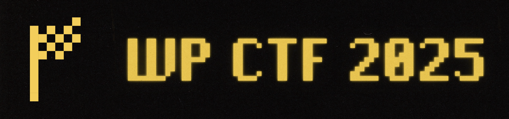

{ WP CTF 2025 } event for young cybersecurity enthusiasts in South Tyrol is back!
The fourth edition of WP Capture the Flag took place on November 29th, 2025 @ Würth IT Italy in Bolzano.
---

# Challenges

This repository contains all the challenges from the competition, including source code, solutions, and walkthroughs.

| Category | Name | Objective | Difficulty [⭐⭐⭐⭐⭐] |
|----------|------|-----------|-------------|
| Warmup | [Warmup](challenges/warmup) | Check the WPCTF Instagram page | ⭐           |
| Crypto | [Spy Infiltration](challenges/crypto/hard/spy-infiltration) | Analyze configuration software, exploit vulnerabilities, and decrypt the hidden IoT password | ⭐⭐⭐⭐⭐       |
| Crypto | [The Admin's New Credentials](challenges/crypto/medium/the-admins-new-credentials) | Access the admin panel and exfiltrate a secret without credentials | ⭐⭐⭐         |
| Misc | [Charger Confessions - Part 1](challenges/misc/easy/charger-confessions-part-1) | Exploit debug mode on MQTT broker to extract secrets from EV charging stations | ⭐           |
| Misc | [Charger Confessions - Part 2](challenges/misc/easy/charger-confessions-part-2) | Get physical access to Hypercharger via ethernet and use credentials from Part 1 | ⭐           |
| Misc | [Host Collector](challenges/misc/easy/host-collector) | Add your host to the system | ⭐⭐          |
| Misc | [Infection Chain](challenges/misc/easy/infection-chain) | Investigate compromised Windows workstation to identify attack delivery, persistence, and encryption method | ⭐⭐          |
| Misc | [Shadow Garden](challenges/misc/easy/shadow-garden) | Restore corrupted video transmission to recover hidden essence | ⭐⭐          |
| Misc | [Blockchain](challenges/misc/medium/blockchain) | Steal Ethereum from blockchain | ⭐⭐          |
| Misc | [Choosing the Right Words](challenges/misc/medium/choosing-the-right-words) | Bypass the brand-new spam filter | ⭐⭐⭐         |
| Misc | [Collateral Damage](challenges/misc/medium/collateral-damage) | Use prompt injection on AI DevOps assistant, extract Docker image, find AWS keys, and exploit Lambda function | ⭐⭐⭐         |
| Misc | [Once Upon a Dev with a Fistful of Pixels](challenges/misc/hard/once-upon-a-dev-with-a-fistful-of-pixels) | Track digital traces of fired developer to identify collaborators | ⭐⭐⭐         |
| OSINT | [Yellow Plate Trace](challenges/osint/easy/yellow-plate-trace) | Find the type approval number from a photo of a white car with yellow license plate | ⭐⭐          |
| OSINT | [Get The Quote](challenges/osint/hard/get-the-quote) | Investigate phishing artifact and trace the attack chain | ⭐⭐⭐         |
| PWN | [System Information](challenges/pwn/easy/system_information) | Bypass login prompt to retrieve the flag from inventory tool | ⭐⭐          |
| PWN | [PWNlemetry](challenges/pwn/medium/pwnlemetry) | Obtain the list of all monitored hosts from the PWNlemetry service | ⭐⭐⭐         |
| PWN | [wpctftpd](challenges/pwn/hard/wpctftpd) | Exploit the company's file sharing service | ⭐⭐⭐⭐⭐       |
| Reversing | [Win12 License Checker](challenges/reversing/easy/win12_license_checker) | Understand why the Macrohard Linux 12 license key is not working | ⭐⭐          |
| Reversing | [Matrioscar](challenges/reversing/medium/matrioscar) | Reverse binary's input handling and craft valid payload to access secret shell | ⭐⭐⭐         |
| Web | [Ping Checker](challenges/web/easy/ping-checker) | Exploit the network diagnostic tool | ⭐⭐          |
| Web | [You Shall Not Pass!](challenges/web/easy/you-shall-not-pass) | Bypass JWT verification to find secret meeting invitation | ⭐⭐          |
| Web | [Monitoring Dashboard](challenges/web/medium/monitoring-dashboard) | Access a different tenant's host in the monitoring system | ⭐⭐⭐         |
| Web | [g0g0g0](challenges/web/medium/gogogo) | Exploit the private file storage service | ⭐⭐⭐         |
| Web | [SQL Builder](challenges/web/hard/sql-builder) | Exploit the SQL builder application | ⭐⭐⭐⭐⭐       |
