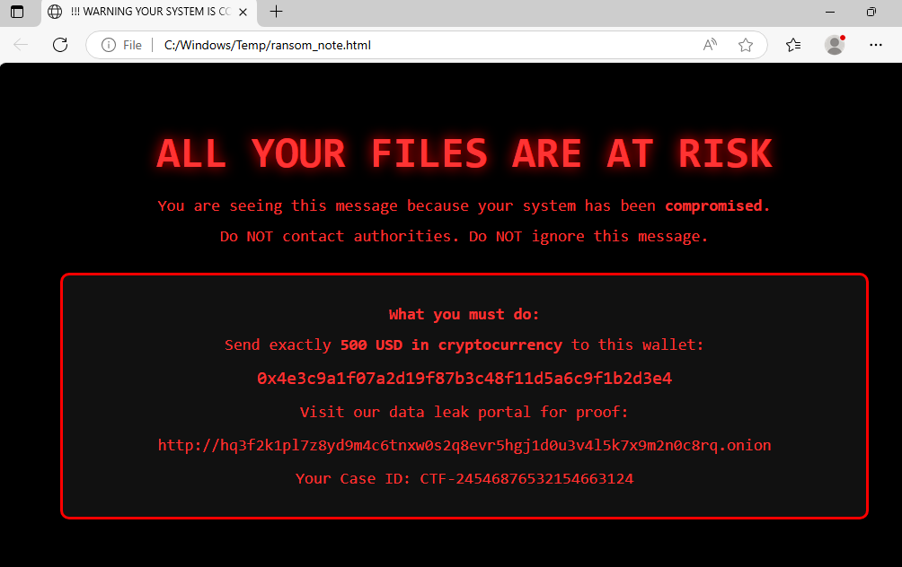
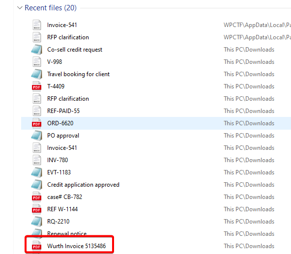
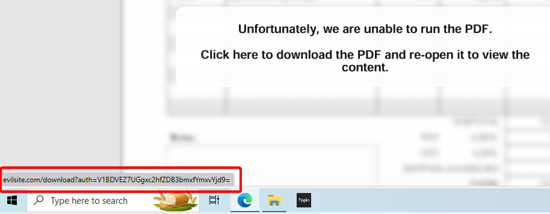
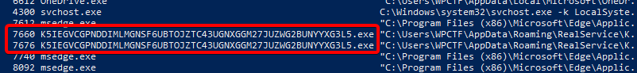
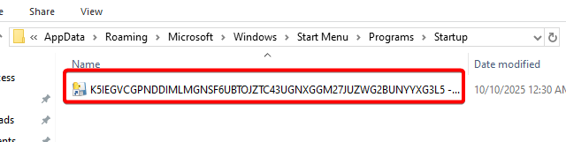
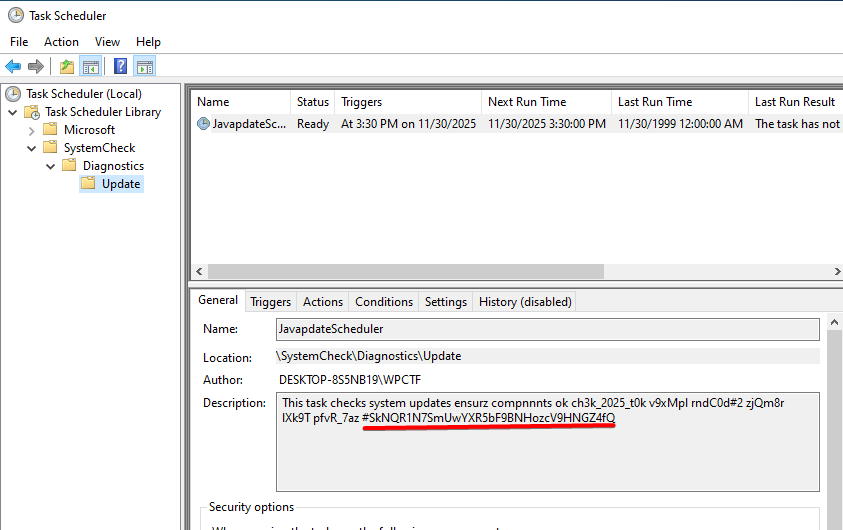

# CHALLENGE WRITEUP

## INTRO
The challenge starts with a ransom note image that simulates a machine compromise.
  

Goals stated by the challenge:
- Identify the delivery method / payload
- Identify the persistence mechanism used by the attacker
- Identify how files/keys will be encrypted

## DELIVERY METHOD

**Summary**: The ransomware was delivered via a malicious PDF invoice which contained a link to download the payload.

#### What we can observe

The employee reported no suspicious installs or program execution, so we can start by looking at recent user activity. The easiest artifact is the user's recently opened files.

Among them, **“Wurth Invoice 513486”** looked suspicious
 

#### Analysis

Opening the PDF produced a "rendering error" and an obvious link prompting the user to download a “new version”

The link pointed to an external resource that probably delivered the malware. From the URL we are able to retrieve a flag: *WPCTF{Ph1sh_d0wnl_blob7}*

## PERSISTENCE MECHANISM

**Summary**: The attacker established persistence by adding a startup entry (a process in the user Startup folder). The startup artifact name was encoded (Base32), which, when decoded, yielded another flag.

#### What we can observe

Enumerating running processes with this simple powershell command: *Get-CimInstance Win32_Process | Select-Object ProcessId, Name, CommandLine* we can find a suspicious executable. 

Ohterwise we can check the folder: **C:\Users\WPCTF\AppData\Roaming\Microsoft\Windows\Start Menu\Programs\StartUp** to find the processes that run on startup.

The name of the process can be decoded from base32 finding another flag: WPCTF{F41l3d_P3rs1st3nc3_M3ch4n1sm}

## SCHEDULED TASK

**Summary**: The ransomware executable (found in C:\Windows\Temp) is scheduled to run via a Windows Task Scheduler task with a misspelled name; decoding the task description produced the final flag (Base64, then ROT13).

#### What we can observe

The ransomware binary itself was found in *C:\Windows\Temp*. To find how it will be executed, we can examine scheduled tasks.

In Task Scheduler we can found a suspicious folder tree: *SystemCheck -> Diagnostics -> Update*. Inside was a misspelled task: *JavapdateScheduler*. Reading the description of this Scheduled Task leads to the last flag: WPCTF{Wr0ngly_N4m3d_T4sk}

