# Walkthrough

## Part 1

### Flag 1
> What is one of the favourite film of the developer? 

This a warmup challenge, we received a hint: `@el_pico` and the fact that he's a developer passionate of western films. Pivoting on the nickname and checking common developer platforms such as GitHub and GitLab didn’t help identify any profile that could be linked to the developer’s identity. However, a newly launched platform called Codeberg might host a new profile potentially associated with the target.

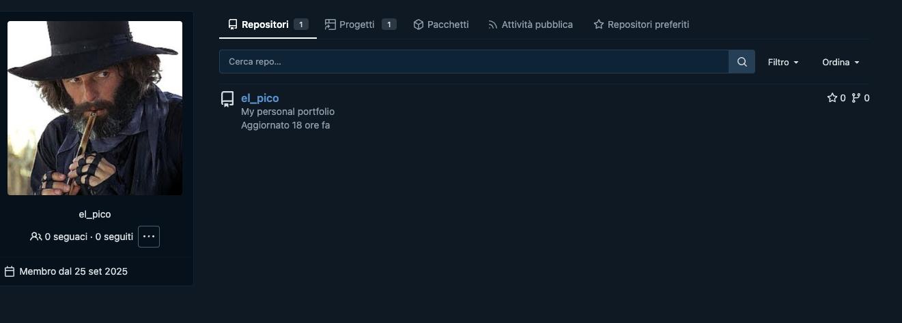

`https://codeberg.org/el_pico`

An image reverse search on the profile pic let you understand that his profile pic is related to a film called `El Topo`. 

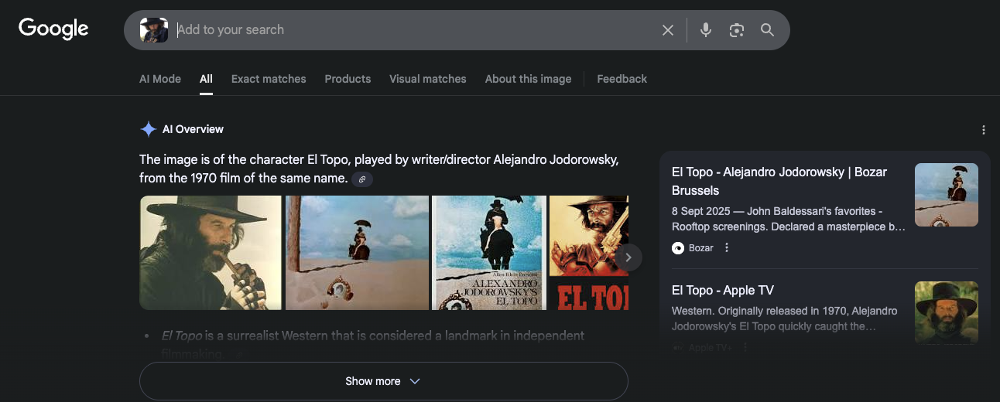

The flag is `WPCTF{El Topo}`.

### Flag 2
> Who is the main actor of the film? 

In the second challenge we have to understand what the name of the main actor who interpreted the character of El Topo. This is a bit tricky because the actor is the director Alejandro Jodorowsky. However, this could be considered another warmup challenge, going in IMDB the flag can be solved pretty straightforward.

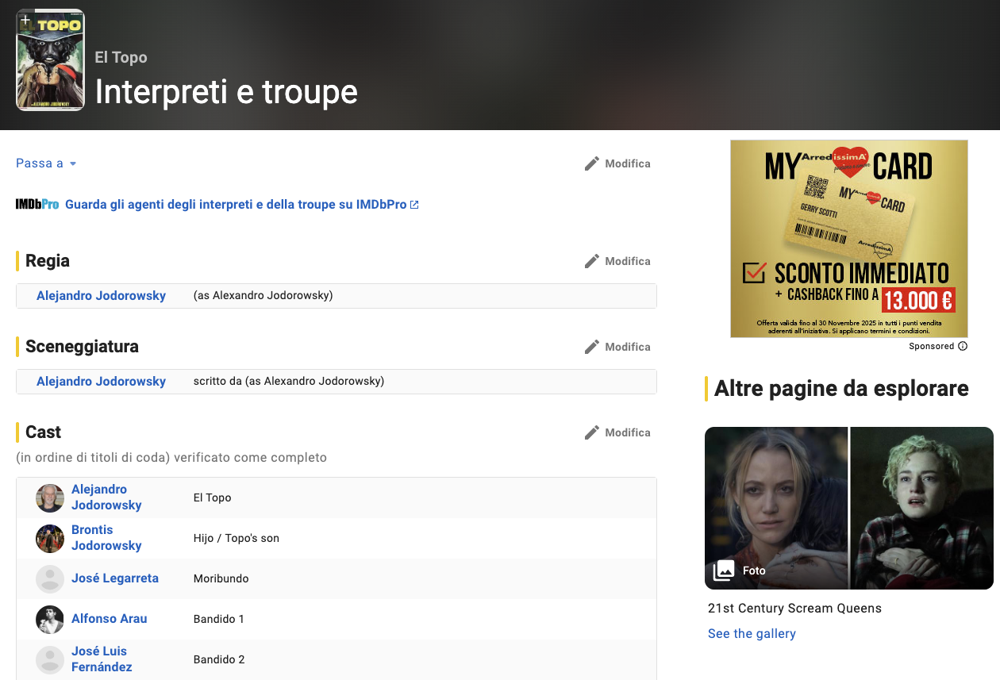

The flag is `WPCTF{Alejandro Jodorowsky}`.

## Part 2 (requires part 1)

### Flag 1
> Where he's hiding his files?

The Codeberg profile of `el_pico` exposed a personal portfolio. Tin the portfolio there are some personal information and an interesting URL that let understand that El Pico used IPFS for hosting his personal data and files.

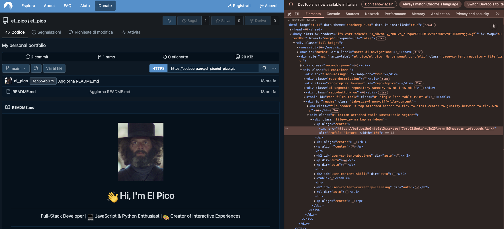

Understanding that the image is host in IPFS we need a way to discover the CID of the directory containing it. One of the things that can be done to understand if the link or the asset was previously identified by some engine or sandbox. In this case we can query URLscan providing the hash of the file.

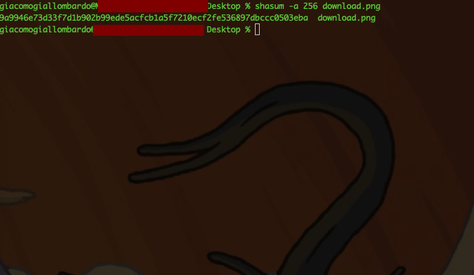

Searching the hash `9a9946e73d33f7d1b902b99ede5acfcb1a5f7210ecf2fe536897dbccc0503eba` on Urlscan let us to understand that the specific artifacts was previously analyzed and detected.

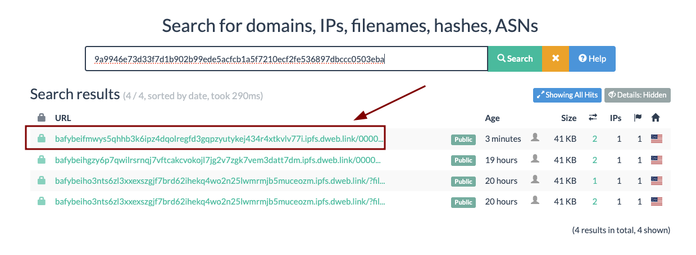

We noted that the artifact was published on 3 different CID both of them related to the official IPFS gateway. This measn that the content changed multiple times and in 2 the identified cases the file was distributed as absolute URL.

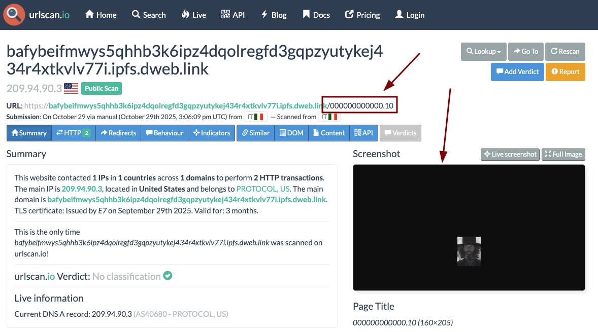

The first CID is pointing to the root directory containg the files.

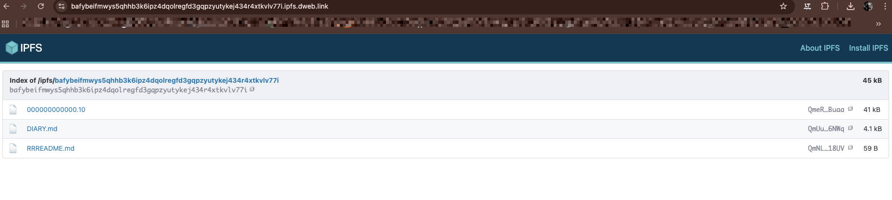

The diredtory is fully navigable and each file can be downloaded, in this case one of them, the file: 

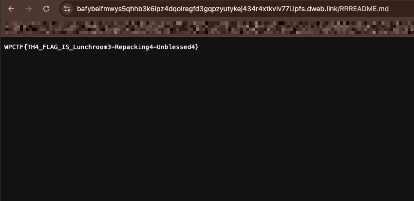

The flag is `WPCTF{TH4_FLAG_IS_Lunchroom3-Repacking4-Unblessed4}`

### Flag 2
> A name of one of his project ( available after - 3 )

Reading the diary that was published in his webspace let you understand that the developer explored how to develop games. Inj one of his experiments started developing PICO8 Games. Understanding how PICO 8 works let you understand that it is a virtual console which uses png files as a cartridge. The cartridge can be distributed as png files and they display a art that raffigure a NES like cartridge of 160px X 205 px.

In this case the portfolio displayed an image with the same size but with a different pattern, the user described his profile as a game developer capable of writing code on LUA script language. All these hint could lead to trying understanding what of the technologies mentioned in DIARY.md supports lua scripts and what kind of format they supports in order to understand what kind of project he developed. The challenge here was understanding that the image could actually contain a game. Who created it tampered the cardridge format in order to be recognized as standard PNG.

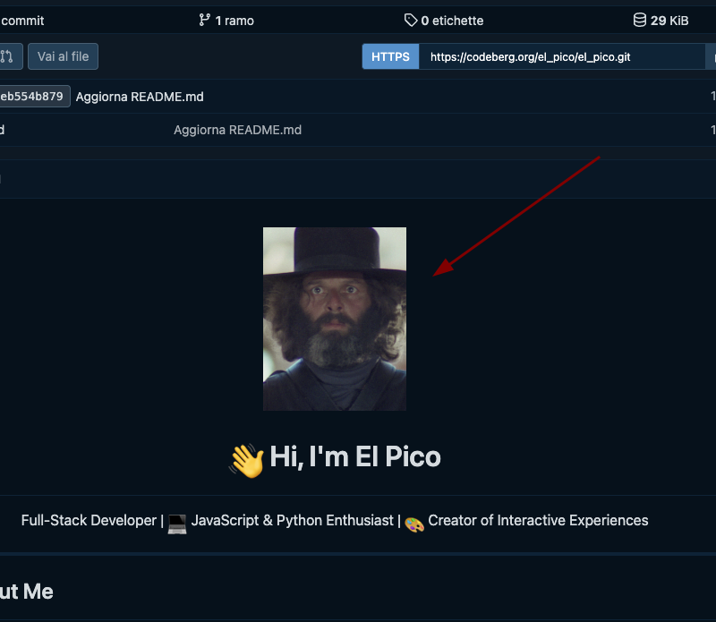

The next step is trying to find a web platform capable to run such format of games.

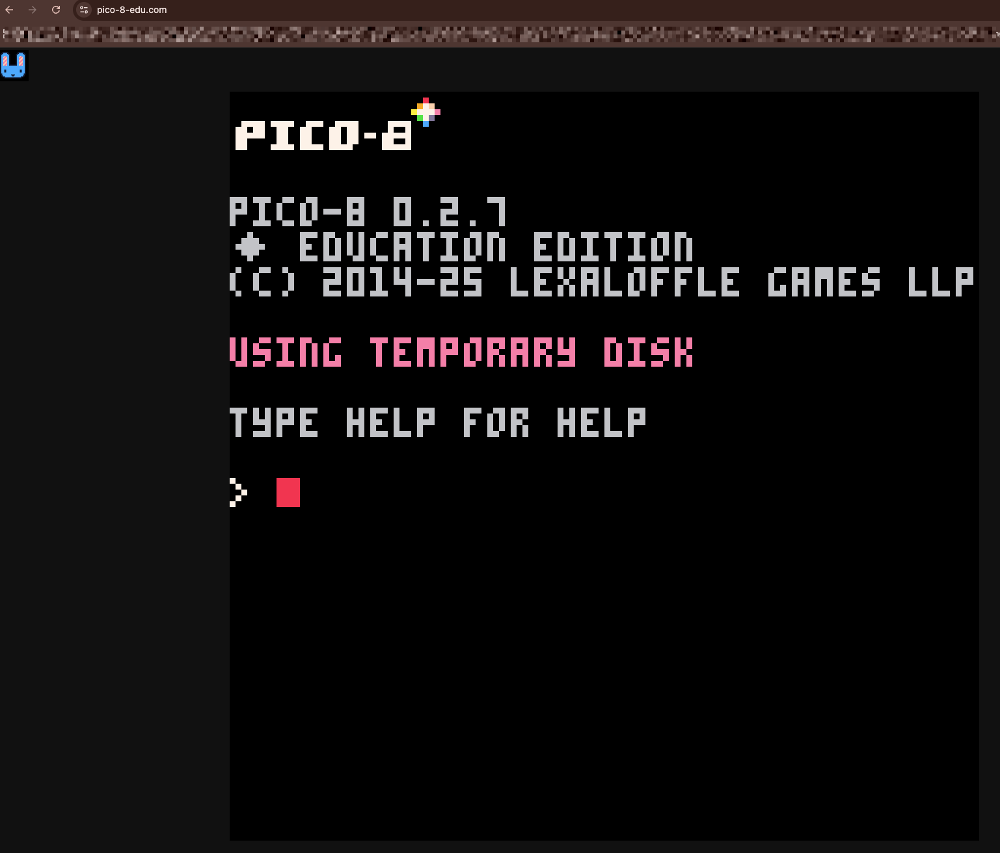

Dragging and dropping the file in the web platform, the console will load the code and using the command `run` it will execute it.

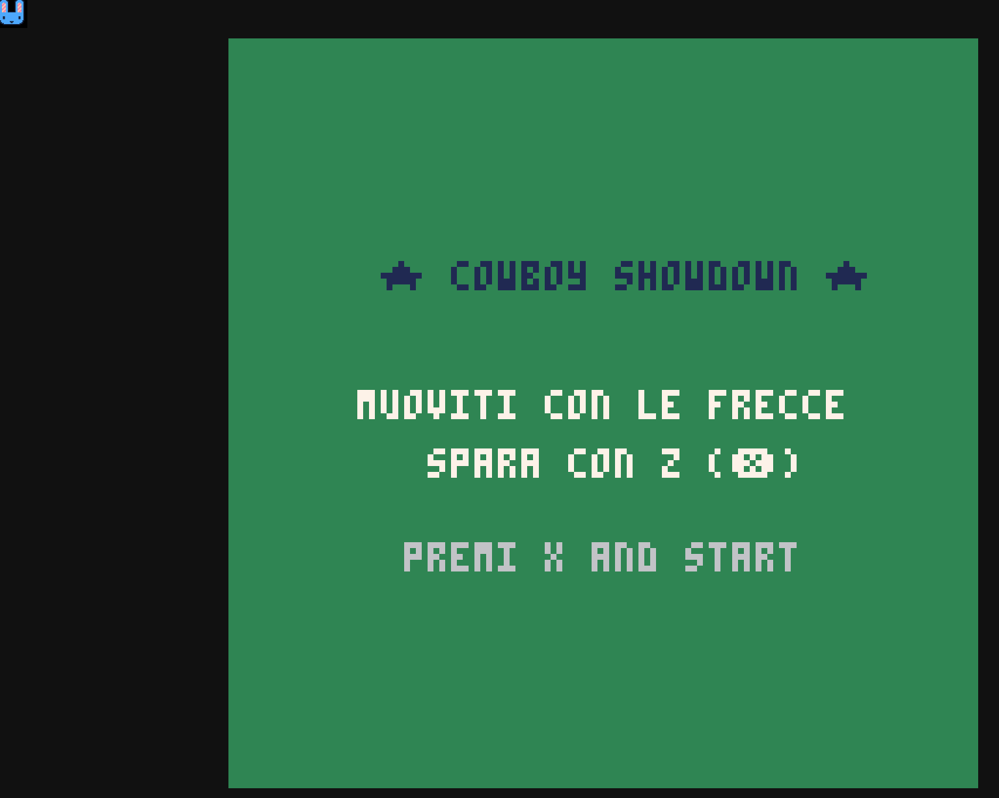

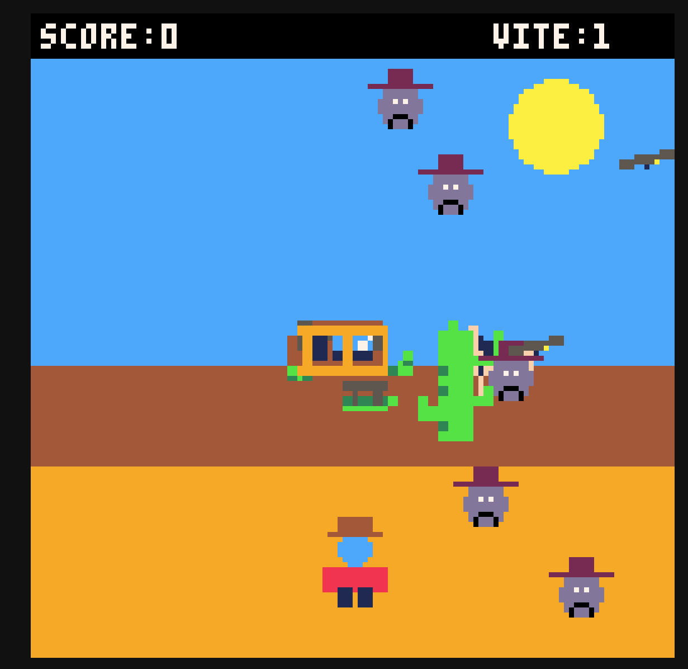

The flag is `WPCTF{COWBOY SHOWDOWN}`

## Part 3 (requires part 2)

### Flag 1
> El malo mariachi

For solving this challenge there are 2 ways, thge first one is playing the game and reaching a score higher than 300. In the second case it could be possible to patch the code. The code of the game is lightly obfuscated and it can be patched tampering the score value or simply forcing the display of the score page.

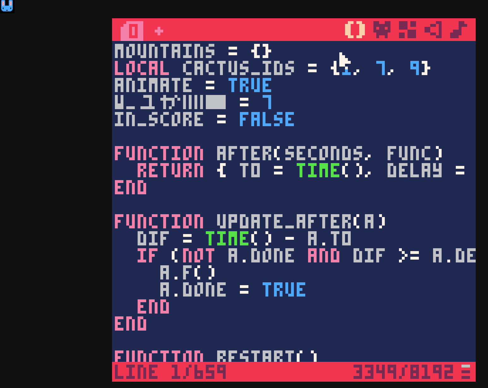

It should be mentioned that the strings are partially obfuscated in the code but the score is hardcoded in the code of the game.
Tampering the score value, a screen showing 3 top players will be shown.

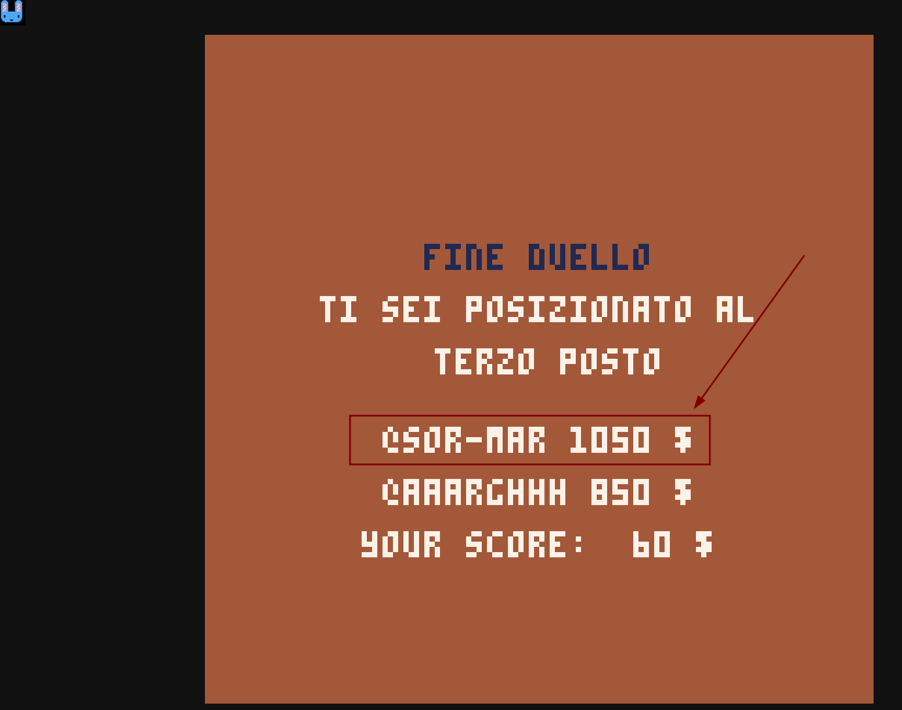

The first on is a user called `@SOR-MAR` and the flag is `WPCTF{@SOR-MAR}`

### Flag 2
> Strange interests

As we know the new profile could be a software developer, as before we could find some hint some social platforms for developers. Searching SOR-MAR in Github let us understand that a persona wich a profile that could match our target of investigations exists.

Searching in waybackmachine or other internet archive engines let us determine that the user updated his profile multiple times.

Searching in waybackmachine or other internet archive engines let us determine that the user updated his profile multiple times. This address `https://web.archive.org/web/20251029113824/https://github.com/sor-mar` exposes aprofile with a different profile pic. 

A simple iimage reverse search let us understand that the profile pic is related to a Magic the Gathering character: `Sorin Markov`. The image is related to a specific card called  `Indicate`. 

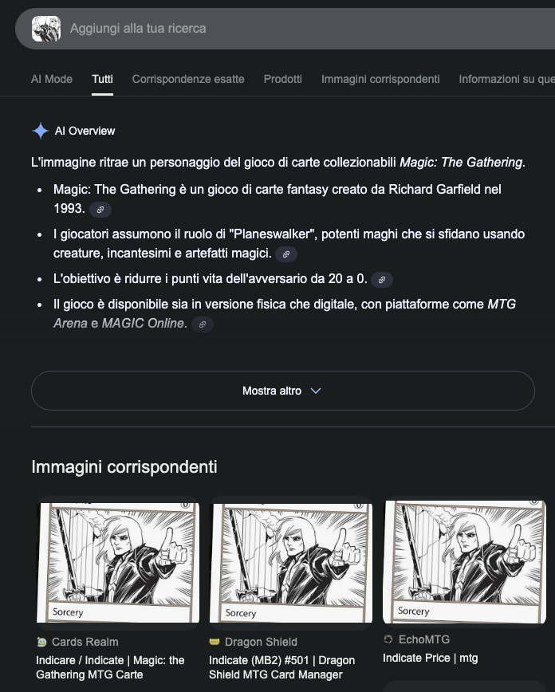

Going through the global Magic dabase ans searching for the specific card let us to identify its related attribute, like the collection and its ID.

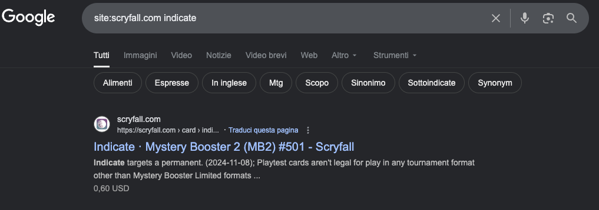

Direcly in the SERP we'll be able to retrive the collection and the number id of the card used fore creating Sorin Markov persona. The flag will be `WPCTF{MB2#501}`
