## Part 1 (Available)  

### Flag 1
What is this artifact? (literally, what is this artifact?)  
> WPCTF{Phishing_Kit}  

Phishing kits are ready to use pack of pages, scripts and artifacts to be deployed on active domains for carrying out phishing activities. They are specific for target and don’t require any advanced coding capability, is very common to see them being sold by some advanced threat actors on cybercrime channels.  
To retrieve phishing kits there are two possibilities:  

- the threat actor uploads and extract the zip and forgets to remove it from the root web directory
- detect malicious domain and monitor for opendir state to detect any file that will be uploaded to retrieve it before it gets removed

### Flag 2
Which URL did the CEO click to get this artifact? (full URL, including http/s)
>WPCTF{https://swissquotech.com/swissquote-2024.zip}  

Using a simple dork against Google search engine is possible to get two analysis report from the JOE sandbox platform that reveal the extended URL where the archive was downloaded from:  

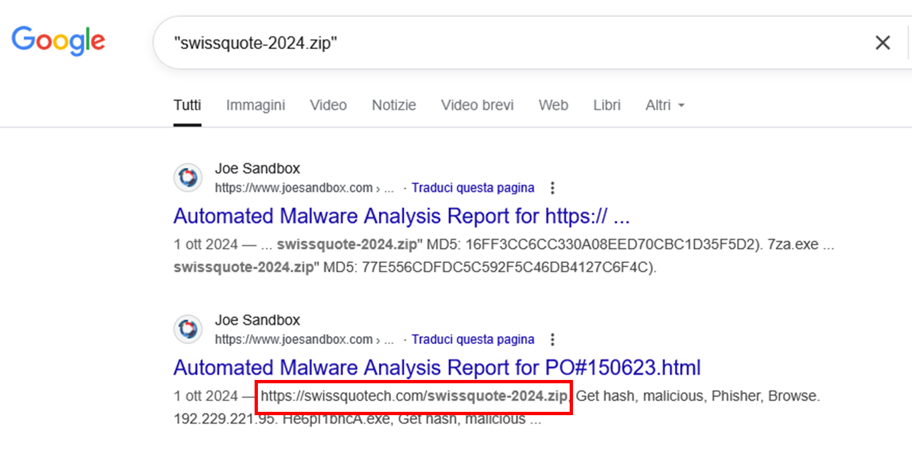

The first search engine result can also be used to obtain this information:  

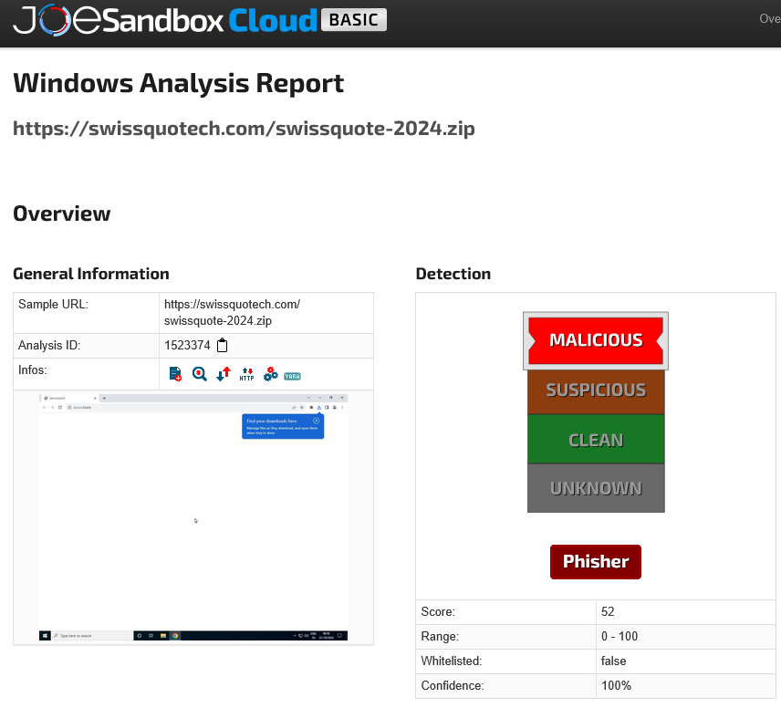

As an additional confirm, using WHOIS domaintools service on the domain swissquotech.com is possible to get a screenshot of the opendir page where the archive was uploaded:  

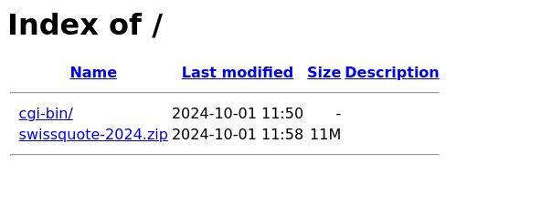

## Part 2 (requires flag 1)

### Flag 1
Which organization is being targeted? (as you have to drive there ;) )
>WPCTF{Swissquote_Group_Holding_SA}  

By searching for the malicious domain swissquotech.com on Google are shown several results related to the domain swissquote.com. This could be dangerous for suspecting users that searches the domain to understand if it’s legit as these results could make them believe that is related to the main official one.  

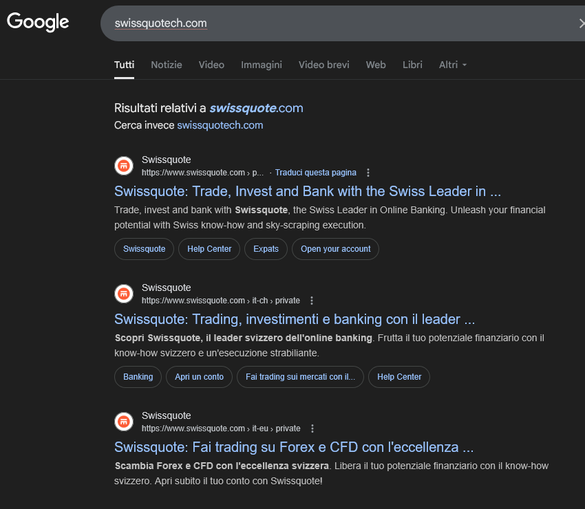  

The amount of results doesn’t fully demonstrate that swissquote.com is the legit domain so the analyst should perform other checks i.e WHOIS to verify the registrant and ownership details.

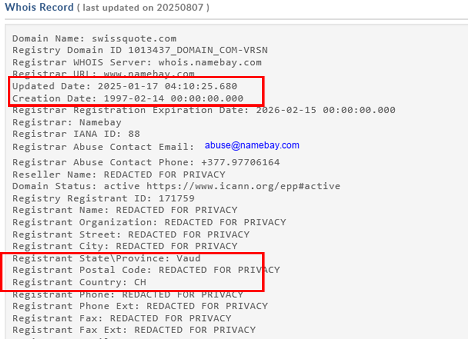  

Although the WHOIS record is almost totally REDACTED FOR PRIVACY, there are some useful elements that can be considered: 
- The domain was registered on Feb 1997, an analyst well knows that a malicious domain can’t last 28 YEARS but in the worst case it stays active for some months.  
- the registrant province and country are set to CH, Vaud

by looking to these last details and excluding the results from the same domain we find that Vaud is a Swiss cantone and Gland is the city where is confirmed the presence of the Swissquote Bank headquarter starting from 1997. 

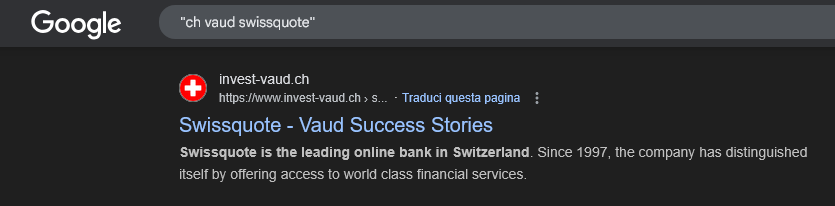  
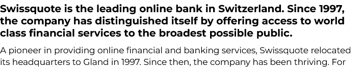  

To confirm this result and get tha flag, a possible way could be to search the domain on Google Maps engine.

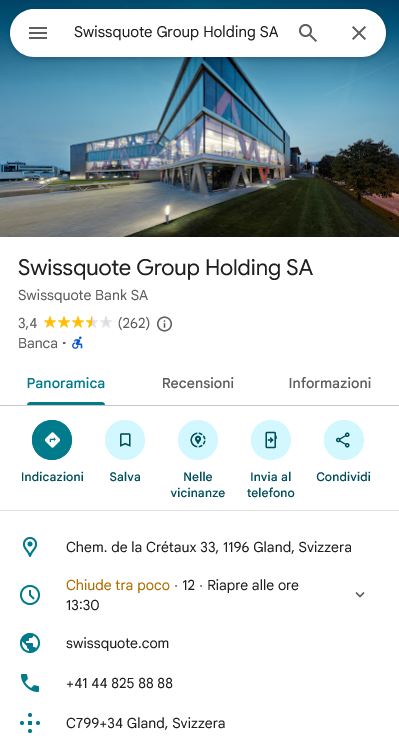

### Flag 2
Which technique was leveraged to place the artifact URL on top of search results?  
>WPCTF{SEO_poisoning}  

SEO poisoning is a widely used technique employed by threat actors to increase the ranking and reputation of their malicious websites by making them look more authentic for unaware users.  

This technique works due to the common assumption that the top results are the most credible and is very effective with users that usually don’t do any check against their search results. 

Without knowing the technique name:  

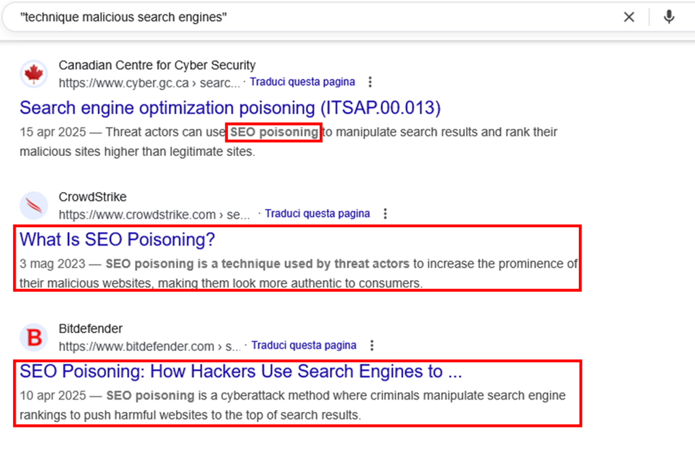

## Part 3 (requires flag 2)

### Flag 1
Who is the actor behind this artifact?  
>WPCTF{goripooL0}  

The developers of such artifacts sometimes leave some contact details or signatures that could be used to identify aliases and informations to pivot for tracking them.

An analyst should also be aware that if the developer left behind any trace, this should be searched in panels, custom scripts and source code. 

We take the sandbox report of the FLAG 02 and start searching for admin|Admin keyword among dropped/written files(common used for management panels) and "\<title>" as usually the panels have a speaking title that could reveal interesting details. 

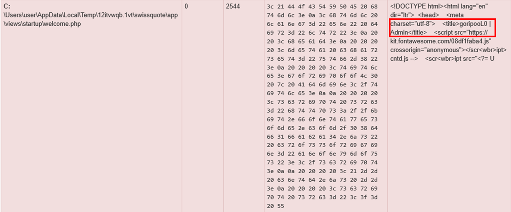

By searching goripooL0 we find several references of fraud activities and advertisement that confirm the identity of the developer  

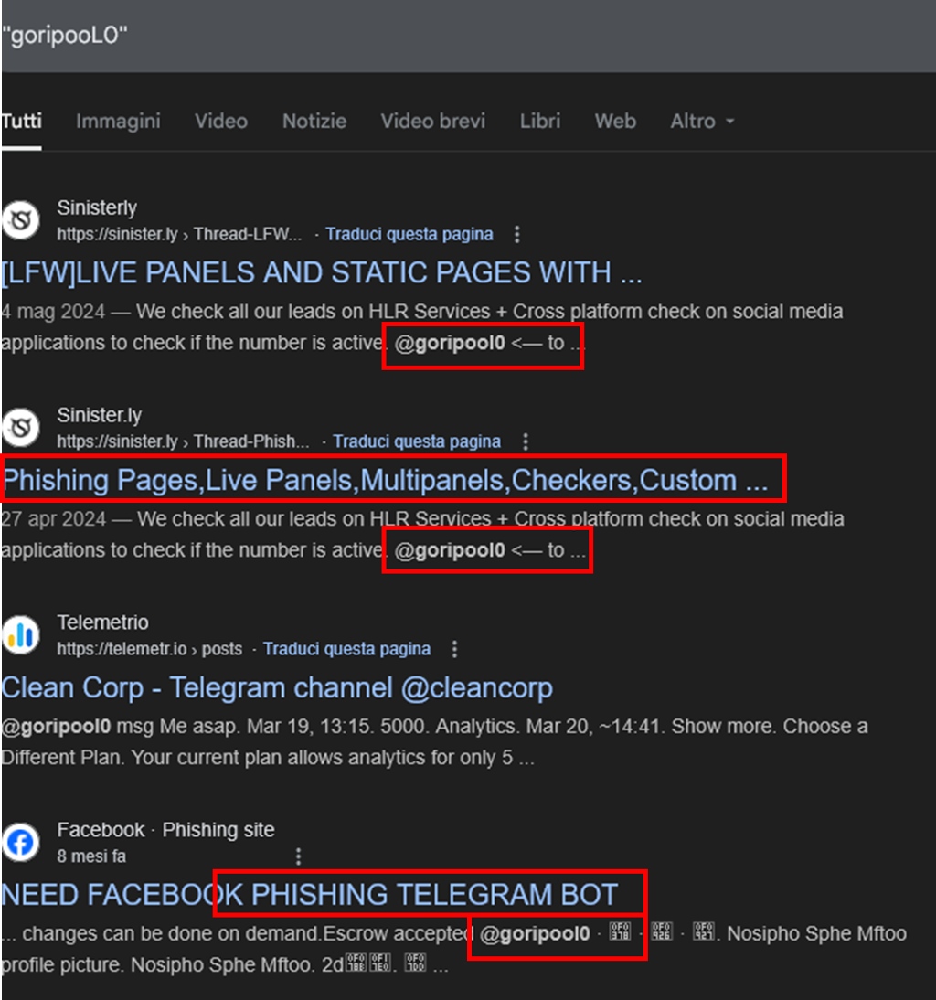  

### Flag 2
Which tool is used to grab and store the collected data?  
>WPCTF{Telegram}

You can get this detail from the previous point writeup.  

## Part 4 (requires flag 3)

### Flag 1
Find the TOKEN used to store the grabbed data  
>WPCTF{7251025799:AAH8kcqq7jjQIcl_d8KJ15CrvETUhWjtxa4}  

This flag is about a configuration parameter that should be hardcoded somewhere within the phishing kit. With pages and all the components required for the phishing pages to work, the developer should have been included the configuration files to manage the grabbed data. In the previous points we found that the developer of this kit has placed some .php admin panels among different patterns so we can expect to find other useful information stored in php files composing this kit. 

Using the sandbox analysis of the FLAG 02 we search again for php headers using the lens at the right bottom:  

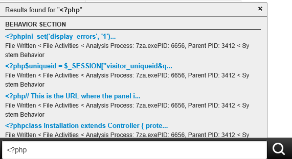  

by carefully looking at the results, we find among the dropped files a config.php that reveals the configuration parameters for the telegram bot used to send the grabbed details.  

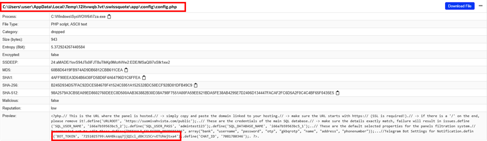  

### Flag 2
Find another similar artifact belonging to the same campaign  
>WPCTF{ledgernewupdated-2025.zip}  

After pivoting the BOT_TOKEN of the previous flag we identify a collection of IoCs compiled by other researchers on Github that reports another artifact hosted on a different domain. As these two domains and associated artifacts are linked to the same telegram token to collect the data they belongs to the same phishing campaign or at least are deployed by the same actor.  

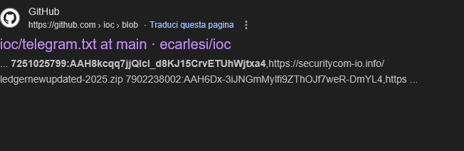  

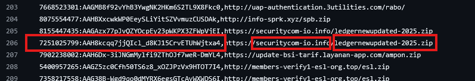  

Additionally, from this repository is possible to get another token 

### Flag 3
Find another domain related to the same campaign  
>WPCTF{securitycom-io.info}

Check the previous point write up.
